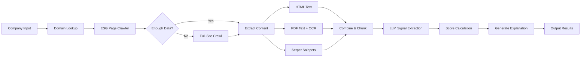

<div align="center">

# 🌍 ESG Scorer

**AI-powered ESG scoring pipeline for comprehensive sustainability analysis**

[](https://python.org)
[](https://streamlit.io)
[](https://openai.com)
[](https://opensource.org/licenses/MIT)

[Features](#-features) • [Quick Start](#-quick-start) • [Usage](#-usage) • [Deployment](#-deployment) • [How It Works](#-how-it-works)

---

*Crawl websites, extract ESG data from HTML & PDFs, query the web for evidence, and generate structured ESG scores with AI-powered analysis.*

</div>

## ✨ Features

### 🔍 Intelligent Data Collection
- **Smart domain lookup** from company names
- **Two-stage crawler** — ESG-targeted first, full-site fallback
- **Multi-format extraction** — HTML pages and PDFs (with OCR)
- **Web-augmented search** via Serper API for ESG PDFs, pages, and snippets

### 🤖 AI-Powered ESG Extraction
Extracts structured signals across all three pillars:

| 🌱 Environmental | 👥 Social | 🏛️ Governance |
|:---|:---|:---|
| Net zero commitments | DEI initiatives | Board independence |
| Renewable energy use | Workplace safety | Ethics policies |
| Emissions disclosure | Community programs | Anti-corruption measures |
| | Employee wellbeing | ESG oversight structure |

### 📊 Comprehensive Scoring
- Weighted scoring across E, S, and G pillars
- Overall composite ESG score
- LLM-generated narrative explanations

### 🖥️ Interactive Web App
Full-featured Streamlit interface for browser-based ESG analysis.

---

## 🚀 Quick Start

### Prerequisites
- Python 3.9+
- OpenAI API key
- Serper API key

### Installation

```bash
# Clone the repository
git clone https://github.com/mustafakaswani10/esg_scorer.git
cd esg_scorer

# Create and activate virtual environment
python3 -m venv .venv
source .venv/bin/activate  # On Windows: .venv\Scripts\activate

# Install dependencies
pip install -r requirements.txt
```

### Configuration

Create a `.env` file in the project root:

```env
OPENAI_API_KEY=your_openai_key
SERPER_API_KEY=your_serper_key
ESG_MODEL=gpt-4.1  # Optional: specify custom model
```

---

## 💻 Usage

### Command Line

```bash
python main.py
```

Enter company names or URLs when prompted:
```
> tesla
> adidas
> https://www.apple.com
```

### Streamlit Web App

```bash
streamlit run app.py
```

The web interface allows you to:
- 📝 Enter any company name or URL
- 📋 View real-time processing logs
- 📈 Explore ESG scores with visual breakdowns
- 🔗 Review all sources (URLs, PDFs, snippets)

---

## ☁️ Deployment

### Deploy to Streamlit Cloud

1. Push your repo to GitHub
2. Visit [share.streamlit.io](https://share.streamlit.io)
3. Create a new app with these settings:
   - **Repository:** `your-username/esg_scorer`
   - **Branch:** `main`
   - **Main file:** `app.py`
4. Add secrets in the Streamlit dashboard:
   ```toml
   OPENAI_API_KEY = "your_key"
   SERPER_API_KEY = "your_key"
   ```
5. Click **Deploy**

---

## ⚙️ How It Works



---

## 📁 Project Structure

```
esg_scorer/
├── app.py              # Streamlit web interface
├── main.py             # Pipeline orchestration
├── esg_extract.py      # LLM-based ESG extraction
├── esg_search.py       # Serper search utilities
├── score.py            # Scoring logic
├── explain.py          # Explanation generation
├── scrape.py           # Web crawling & HTML fetching
├── text_utils.py       # Text cleaning & chunking
├── pdf_utils.py        # OCR-based PDF processing
├── embeddings.py       # Text embeddings
├── domain_lookup.py    # Official domain resolution
├── requirements.txt
└── README.md
```

---

## 🔑 Environment Variables

| Variable | Required | Description |
|:---------|:--------:|:------------|
| `OPENAI_API_KEY` | ✅ | Powers LLM extraction and explanation generation |
| `SERPER_API_KEY` | ✅ | Enables web search for ESG evidence |
| `ESG_MODEL` | ❌ | Custom model override (default: `gpt-4.1`) |

---

## 📄 License

This project is licensed under the [MIT License](LICENSE).

---

<div align="center">

**[⬆ Back to Top](#-esg-scorer)**

Made with 💚 for sustainable investing

</div>